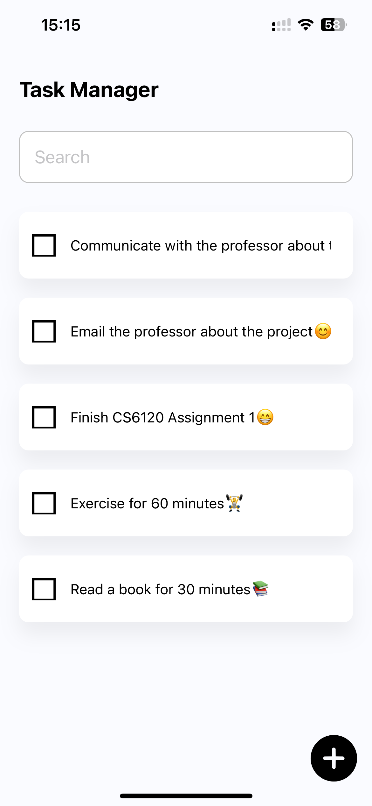
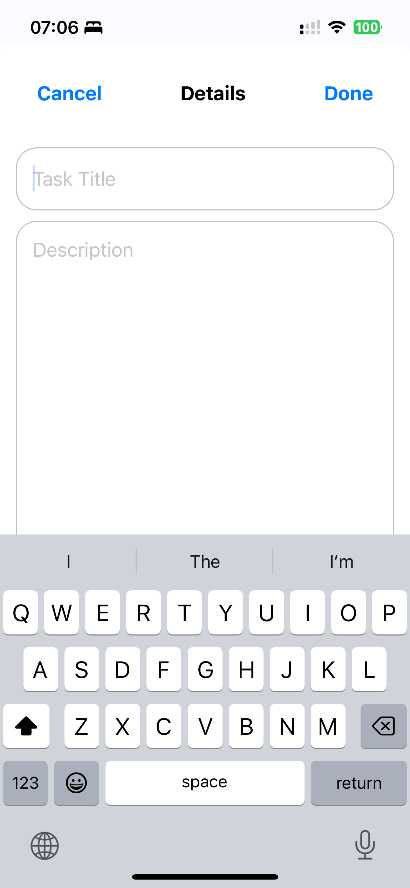
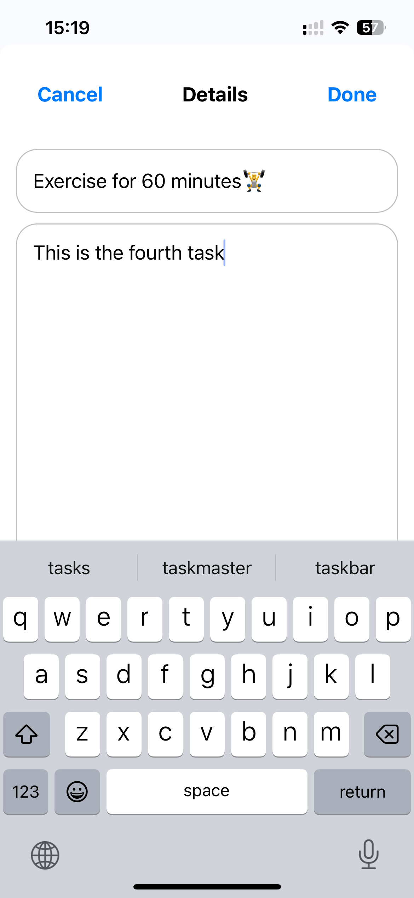
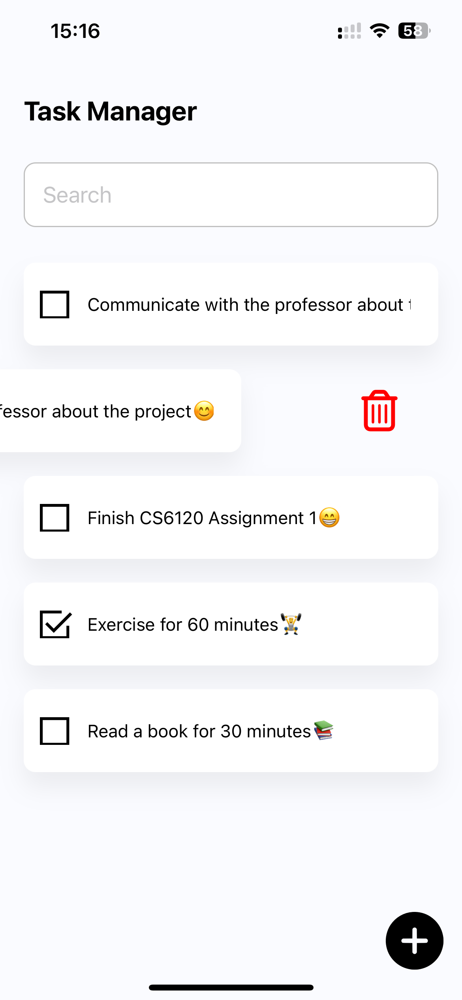
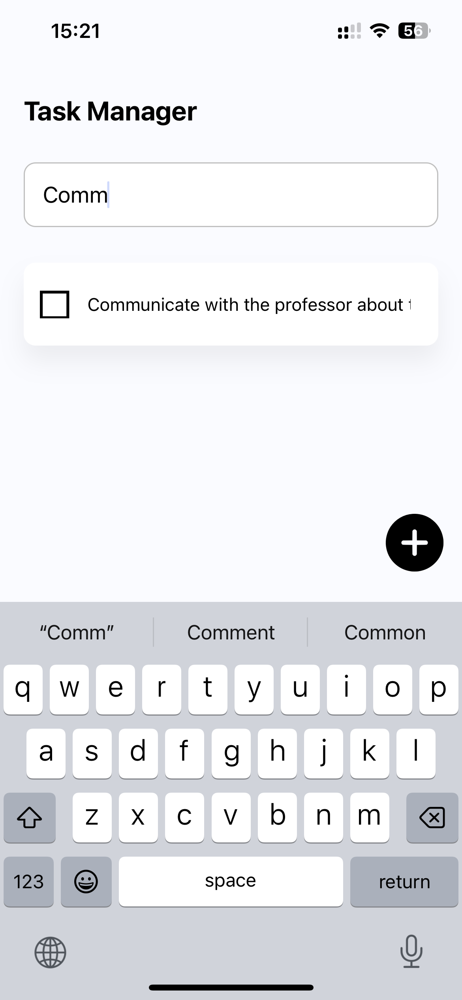

# Welcome to Task Manager 👋

This is an [Expo](https://expo.dev) project with typescript.


## Video Presentation

https://youtube.com/shorts/suTlhkuX-3c?feature=share


## Get started

1. Install dependencies

   ```bash
   npm install
   ```

2. Start the app

   ```bash
    npx expo start
   ```

In the output, you'll find options to open the app in a

- [development build](https://docs.expo.dev/develop/development-builds/introduction/)
- [Android emulator](https://docs.expo.dev/workflow/android-studio-emulator/)
- [iOS simulator](https://docs.expo.dev/workflow/ios-simulator/)
- [Expo Go](https://expo.dev/go), a limited sandbox for trying out app development with Expo

You can start developing by editing the files inside the **app** directory. This project uses [file-based routing](https://docs.expo.dev/router/introduction).


## Screenshot Overview

#### 1. Task List



#### 2. Add New Tasks



#### 3. Edit Task



#### 4. Delete Task



#### 5.Toggle Status


#### 6. Detail Screen


#### 7. Search Functionality


